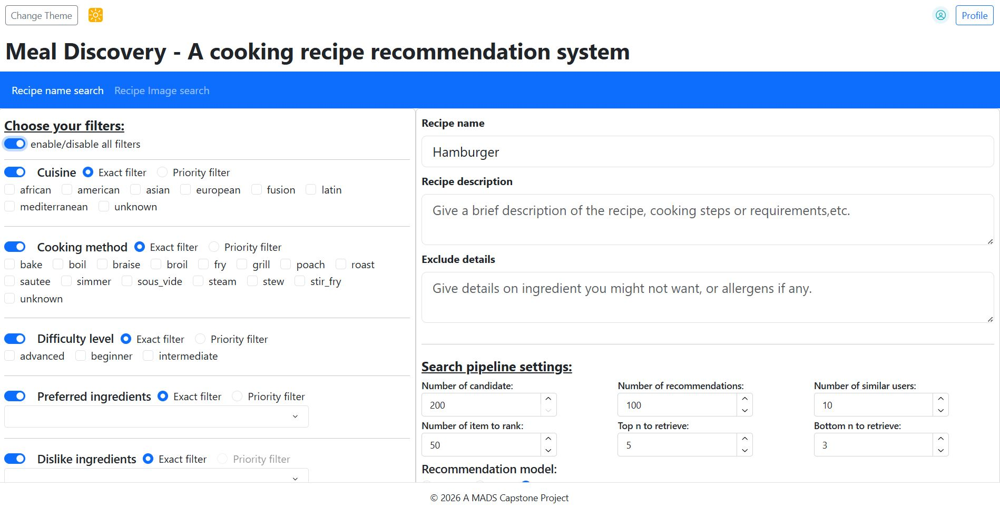

# Food recipe recommendation system

## Table of Contents
- [About this project](#about-this-project)
- [Getting started](#getting-started)
    - [Environment Setup](#environment-setup)
    - [Data access](#data-access)
    - [Credentials](#credentials)
    - [UI initialization](#ui-initialization)
- [Support materials](#support-materials)
    - [Image multiclassification](#image-multiclassification)
    - [Recommendation models](#recommendation-models)
    - [AWS Bedrock feature engineering](#aws-bedrock-feature-engineering)
- [Project Organization](#project-organization)
- [Contributors](#contributors)

## About this project

A food recipe recommendation system built to help users find matching recipes based on searching criteria, it can support long-term and short-term preferences by using query modification technique. The UI support a large change of filter criterias and support different recommendation models.



## Getting started

This project requires the installation of `pip` and `make` command to work. The project runs stable on Python version 3.11.

### Environment Setup

Create the virtual environment in the main directory.

```
python -m venv venv
```

Activate the virtual environment

```
source venv/bin/activate
```

From the main directory, the users can install the package requirement using the PIP command:

```
pip install -r requirements.txt
```

or you can also use the customized Makefile command, which include creating .env variables from template:

```
make setup
```

There is a few extra libraries that require CUDA but pip can't detect your machine CUDA version upfront, so you have to install it yourself after figure out whether your machine support CUDA and which version it is.

The list of libraries that require CUDA: 
- `torch` : for example my machine can use `pip install torch --index-url https://download.pytorch.org/whl/cu126`

### Data access

The data we used for this project is a combination of two datasets which are available for download from Kaggle.

- [Food.com - Recipes and Reviews](https://www.kaggle.com/datasets/irkaal/foodcom-recipes-and-reviews)
- [foodRecSys-V1](https://www.kaggle.com/datasets/elisaxxygao/foodrecsysv1)

NOTE: 

We have already cut the cleaned & processed dataset into chunks which allowed us to save the data in the repository. To combine the chunks into full datasets, you can use the utility function at in `project_package.data_collection.utility` or take a look at notebook No.6 for implementation.

### Credentials

In the `.env` file (or `.env_template` if you haven't run `make setup`). There are some key variables that are required to host the application in AWS. If you don't play to deploy it in the cloud, you can just fill in the path to store the models then run the application locally.

### UI initialization

We have a few pretrained models in `models/recommendation_models/first_chunk_models` which you can copy to `models/recommendation_models` to use.

For image classification models, due to storage limit in Github we can't create a toy version. Please follow the instruction in the relevant notebooks to train the models and copy it to `models/ingredient_models` to use the `image_search` page.

To run the web UI locally, you can run the following command, it will host the application in local port 8080. Please note if this is the first time you run the application, it will download some embedding models and nltk packages.

```
python -m dash_app.app
```

## Support materials 

In the `notebooks` directory. There are many support notebooks used for data preprocessing and model training pipeline.

There is a inbuilt `project_package` package for the project which store all functionalities used in the notebook and the Dash UI application. You can be import it directly with `import project_package`.

### Image multiclassification

To create the `torch` models used in the UI for image tasks, please look at notebook No.4. The trained model should be saved to `models/ingredient_models/best_ingredient_model_cosine.pth`.

### Recommendation models

To retrain the the recommendation models on full dataset (saved in `data`), please take a look at notebook No.6.

### AWS Bedrock feature engineering

The `scripts` directory contains all support scripts for preproducing the feature engineering step in AWS, database schema, and data migration to RDS.

## Project Organization

```
├── LICENSE            <- Open-source license.
├── Makefile           <- Makefile with convenience commands.
├── README.md          <- The top-level README.
├── dash_app
│   ├── pages          <- Web UI pages.
│   └── assets         <- Web UI assets such as css, png files,etc.
│
├── data
│   ├── external       <- Store dummy datasets.
│   └── processed      <- The final, canonical data sets for modeling.
│
├── models             <- Trained and serialized models, model predictions, or model summaries
│
├── notebooks          <- Jupyter notebooks. Naming convention is a number (for ordering), 
│                         e.g. `1.1. Review_data_collection.ipynb`, `1.2. Recipe_data_collection.ipynb`.
│
├── pyproject.toml     <- Project configuration file with package metadata for 
│                         project_package and configuration for tools like black
│
├── references         <- Reference materials.
│
├── reports            <- Store project report.
│
├── scripts            <- Store all script for feature engineering in AWS and Database creation.
│
├── requirements.txt   <- The requirements file for reproducing the analysis environment, e.g.
│                         generated with `pip freeze > requirements.txt`
│
├── setup.cfg          <- Configuration file for flake8
│
└── project_package   <- Source code for use in this project.
```

## Contributors
* Kha Nguyen (minhkha@umich.edu)
* Naiwen Duan (nduan@umich.edu)
* Susan Oseili (susanhat@umich.edu)
* Jordan Huang (jordanhu@umich.edu)

--------

